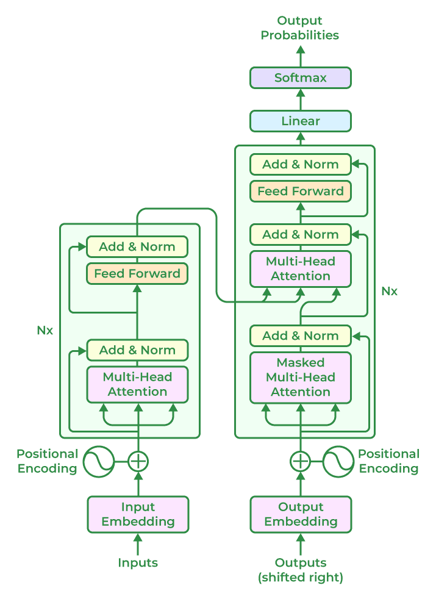

# Page 1
## Extracted Text
1 
Research on Large Language Models 
(LLM) 
 
 
 
Riya Singh 
Northeastern University 
INFO7375 41072 Prompt Engr for Generative AI 
Prof. Shirali Patel 
January 25, 2025 

## Extracted Tables
_No tables found on this page._

## Extracted Images
_No images found on this page._

---

# Page 2
## Extracted Text
2 
Introduction 
What are LLMs? 
A large language model is a powerful artificial intelligence system trained on vast 
amounts of text data. Large Language Models (LLMs) are advanced AI systems built on 
transformer architecture, which includes neural networks with self-attention mechanisms. 
They are trained on vast datasets to understand language patterns, contexts, and nuances, 
enabling them to perform tasks like text generation, translation, summarization, and question 
answering. These models excel at producing human-like text by predicting words or phrases 
based on context. A notable example is GPT-3, with 175 billion parameters, showcasing the 
scale and capability of modern LLMs. 
Significance of LLMs in artificial intelligence and natural language processing 
A Large Language Model (LLM) is an advanced AI system designed for natural 
language understanding and generation. Using neural networks with millions to billions of 
parameters, LLMs are trained on extensive datasets to predict, generate, translate, and 
summarize text with human-like precision. 
In Natural Language Processing (NLP), LLMs are essential for understanding 
language patterns and performing tasks like question answering, sentiment analysis, and 
information retrieval, thanks to their deep learning on massive datasets. 
Effect of LLM 
Large Language Models are transforming AI and NLP by enabling machines to 
interact with human language more effectively. Their versatility and contextual 
understanding power a wide range of applications, including chatbots, virtual assistants, 
content creation, automated customer support, and personalized data classification. As they 
continue to evolve, LLMs are becoming indispensable tools in the rapidly advancing AI 
landscape. 

## Extracted Tables
_No tables found on this page._

## Extracted Images
_No images found on this page._

---

# Page 3
## Extracted Text
3 
 
Development and Architecture 
Architecture of LLM 
Transformer-based LLMs consist of input embeddings, where tokens are converted 
into vectors, and positional encoding to track token order. The encoder processes these 
embeddings using self-attention and feed-forward networks. Optional decoder layers are used 
for output generation, attending to encoder outputs and previous tokens. Multi-head attention 
captures different relationships in parallel, while layer normalization stabilizes training. The 
output layer typically includes a projection followed by a SoftMax function for token 
prediction. 
 
 
Training Process 
The training process of models involves three key steps: pretraining, where models learn 
linguistic patterns by predicting tokens from vast text datasets; fine-tuning, which adapts 
models to specific tasks using smaller datasets; and reinforcement learning with human 
feedback (RLHF) to align outputs with human preferences. Training requires high-
performance GPUs/TPUs, extensive memory, and distributed systems, as well as efficient 
pipelines to handle terabyte-scale datasets. It can take weeks to months, with optimizations 
like gradient accumulation, mixed precision training, and parallelism enhancing efficiency. 

## Extracted Tables
_No tables found on this page._

## Extracted Images

---

# Page 4
## Extracted Text
4 
Library 
Text Extraction Tables Images OCR Support Manipulation 
PyPDF2 
✔ 
❌ 
❌ 
❌ 
✔ 
pdfplumber 
✔ 
✔ 
Limited ❌ 
❌ 
PyMuPDF (fitz) ✔ 
✔ 
✔ 
❌ 
✔ 
Camelot 
❌ 
✔ 
❌ 
❌ 
❌ 
Tabula-py 
❌ 
✔ 
❌ 
❌ 
❌ 
PDFMiner 
✔ 
❌ 
❌ 
❌ 
❌ 
Tika 
✔ 
❌ 
Limited ❌ 
❌ 
Slate 
✔ 
❌ 
❌ 
❌ 
❌ 
Pytesseract 
✔ (OCR-based) ❌ 
✔ 
✔ 
❌ 
pdfrw 
❌ 
❌ 
❌ 
❌ 
✔ 
 
 
 
 
 
 
 
 
 
 
 
 
 
 
 
 
 
 

## Extracted Tables
[Extracted Table 1](extracted_tables/page_4_table_1.csv)

## Extracted Images

---

# Page 5
## Extracted Text
5 
 
Applications 
Key Applications of LLMs Across Industries 
(Healthcare, Medical Assistance): Generate patient summaries, draft clinical notes, and assist 
in diagnosis. 
(Finance, Fraud Detection): Analyze transaction patterns to identify anomalies. 
(Customer Service, Chatbots & Virtual Assistants): Handle inquiries, complaints, and FAQs 
efficiently. 
(Education, Tutoring): Provide personalized learning experiences and explanations. 
(Media & Entertainment, Content Creation): Draft scripts, blogs, or social media posts. 
Effect of LLM’s in today’s world 
Mayo Clinic uses LLMs to streamline clinical documentation by transcribing and 
summarizing doctor-patient interactions in real-time. These systems leverage natural 
language processing (NLP) to: 
1. Transcribe Conversations: Convert spoken interactions into accurate text. 
2. Summarize Key Points: Extract relevant medical details like symptoms, diagnoses, 
and treatment plans. 
3. Generate Reports: Automatically create structured clinical notes for electronic 
health records (EHRs), reducing manual effort. 
 
 

## Extracted Tables
_No tables found on this page._

## Extracted Images
_No images found on this page._

---

# Page 6
## Extracted Text
6 
 
Challenges and Ethical Considerations 
Challenges faced during development and deployment 
Large language models (LLMs) offer powerful capabilities for tasks like text 
generation and summarization, but building them from scratch poses several obstacles: 
• 
Huge datasets are nearly impossible to fully verify, risking errors or privacy breaches. 
• 
Tokenization introduces complexities like glitch tokens and variable costs, especially 
for multi-lingual support. 
• 
Fine-tuning massive models requires high memory and compute, leading to practical 
and financial hurdles. 
• 
Inference can be slow and expensive, due to token-by-token decoding and large 
memory footprints. 
• 
Models sometimes produce incorrect or misleading content (hallucinations), and 
ensuring factual accuracy remains a challenge. 
• 
Outdated knowledge in the model is difficult to update without repeated retraining or 
specialized editing methods. 
How ethical is an LLM? 
The ethical considerations in LLMs primarily involve addressing biases that arise from 
training data, including stereotypical, gender, and cultural biases. These biases can perpetuate 
discrimination and inequality, impacting the fairness and equity of AI applications. Ethical 
challenges include ensuring transparency, accountability, and privacy in their deployment. 
Mitigating bias and fostering responsible AI development are crucial to prevent harmful 
consequences while leveraging LLMs' benefits. 
 
 

## Extracted Tables
_No tables found on this page._

## Extracted Images
_No images found on this page._

---

# Page 7
## Extracted Text
7 
 
 
Conclusion 
In conclusion, Large Language Models (LLMs) represent a groundbreaking advancement in 
artificial intelligence and natural language processing, enabling machines to perform complex 
language-related tasks with human-like accuracy. From text generation and sentiment 
analysis to applications in healthcare, finance, and customer service, LLMs are 
revolutionizing industries by enhancing efficiency, personalization, and decision-making. 
However, the development and deployment of LLMs present significant challenges, 
including data privacy concerns, computational costs, and the risk of biases influencing 
model outputs. Addressing these ethical considerations and optimizing the models for 
accuracy and fairness are crucial for ensuring the responsible use of LLMs in the future. As 
the technology evolves, LLMs will continue to shape the way we interact with machines, 
offering new possibilities for innovation while necessitating careful handling of their 
implications. 
Parsing The Future: The Promises and Perils of Large Language Models 
Future large language models (LLMs) are set to transform how people and businesses interact 
with AI, enabling applications ranging from advanced data analytics to highly sophisticated 
conversational agents. These advancements promise more intuitive tools, enhanced decision 
support, and seamless AI integration into daily life. However, as LLMs grow in power, 
challenges such as bias, misinformation, and harmful outputs need to be addressed. Ensuring 
transparency and ethical alignment, particularly in sectors like healthcare, finance, and 
education, will be essential. Collaborative efforts among researchers, policymakers, and 
industry leaders will shape the responsible deployment and governance of LLMs, influencing 
their long-term societal impact. 

## Extracted Tables
_No tables found on this page._

## Extracted Images
_No images found on this page._

---

# Page 8
## Extracted Text
8 
References 
1. Hessie Jones. (2024, June 21). Parsing the future: The promises and perils of large 
language models. Forbes. Retrieved from 
https://www.forbes.com/sites/hessiejones/2024/06/21/parsing-the-future-the-
promises-and-perils-of-large-language-models/ 
2. Appy Pie. (n.d.). Ethics and bias in LLMs. Retrieved from 
https://www.appypie.com/blog/ethics-and-bias-in-llms 
3. Labellerr. (n.d.). Challenges in the development of LLMs. Retrieved from 
https://www.labellerr.com/blog/challenges-in-development-of-llms/ 
4. Segmind. (n.d.). Understanding the generative AI compute requirements: LLMs vs. 
diffusion models. Retrieved from https://blog.segmind.com/understanding-the-gen-ai-
compute-requirements-llms-vs-diffusion-models/ 
5. GeeksforGeeks. (n.d.). Large language models (LLMs). Retrieved from 
https://www.geeksforgeeks.org/large-language-model-llm/ 
6. Run:AI. (n.d.). LLM training. Retrieved from https://www.run.ai/guides/machine-
learning-engineering/llm-training 
7. Huang, P., et al. (2023). Understanding generative AI compute requirements. arXiv 
preprint arXiv:2307.06435. Retrieved from https://arxiv.org/pdf/2307.06435 
 

## Extracted Tables
_No tables found on this page._

## Extracted Images
_No images found on this page._

---

